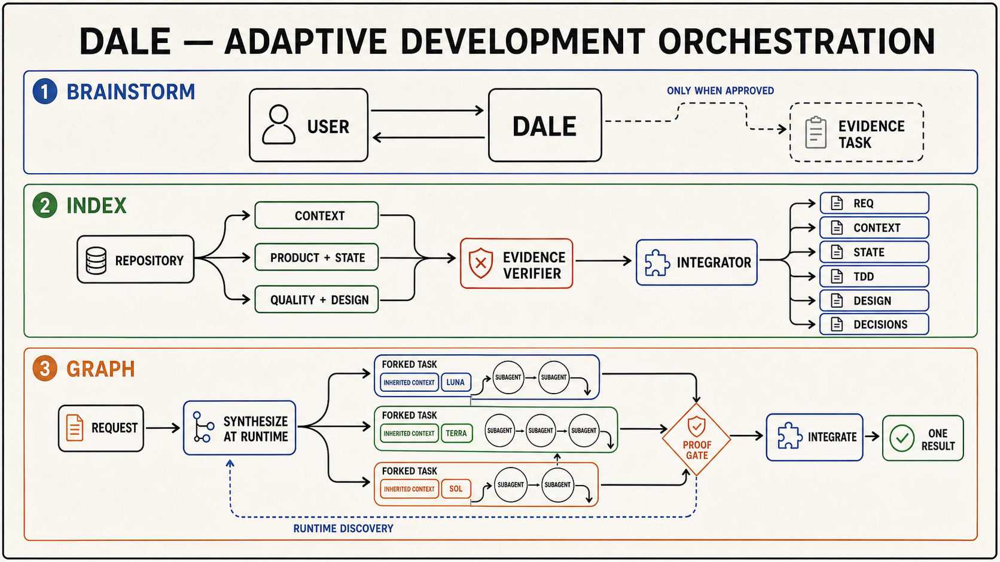

# Dale

A compact development toolbox for Codex: think one-on-one, build a trusted
repository index, or synthesize a task graph that adapts while it runs.



## Skills

### `$dale-brainstorm`

A focused conversation between you and the current Codex agent. It keeps the
work in exploration mode instead of rushing into a plan or implementation.

- stays one-on-one by default;
- separates evidence, assumptions, preferences, and unknowns;
- challenges the strongest option instead of agreeing automatically;
- proposes at most one visible evidence task, only when a separable research
  question emerges and you explicitly approve it;
- routes an approved evidence task to the cheapest sufficient GPT-5.6 model.

### `$dale-index`

Turns the current repository into six evidence-backed project primitives:

| Primitive | Source of truth for |
|---|---|
| `REQ.md` | Product intent, scope, requirements, and acceptance criteria |
| `CONTEXT.md` | Architecture, repository map, contracts, and constraints |
| `STATE.md` | Current objective, active work, blockers, risks, and next actions |
| `TDD.md` | Test strategy, commands, quality gates, and missing coverage |
| `DESIGN.md` | Visual language, primitives, states, and accessibility |
| `DECISIONS.md` | Durable decisions, alternatives, evidence, and consequences |

Dale launches three parallel, read-only discovery tasks, then sends their raw
reports through an adversarial evidence verifier. The calling task is the sole
integrator and writes only claims that survive verification.

Each visible task is routed independently across GPT-5.6 Luna, Terra, and Sol.
Repository inventory does not default to frontier-level reasoning.

### `$dale-graph`

Builds a unique execution graph directly from the request. It does not choose a
fixed diamond, pipeline, debate, or other remembered template.

1. Derives observable outcomes, artifacts, evidence boundaries, and ownership.
2. Creates only the nodes and edges justified by the work.
3. Forks the calling Codex task when available, inheriting its completed
   history and project context.
4. Sends the active request and exact node contract into every fork because an
   unfinished turn is not part of inherited history.
5. Routes every node to the cheapest sufficient GPT-5.6 model and reasoning
   effort.
6. Lets every visible node orchestrate one bounded layer of node-local
   subagents inside its own authority and write scope.
7. Rebuilds the graph when runtime evidence changes dependencies, proof needs,
   or required work.
8. Verifies, rejects, revises, and integrates surviving artifacts into one
   result.

The outer graph remains visible and user-owned. Node-local subagents cannot
create Codex tasks, expand authority, or spawn another agent layer.

## GPT-5.6 routing

| Model | Default role |
|---|---|
| Luna | Bounded discovery, inventory, extraction, and narrow checks |
| Terra | Everyday implementation, debugging, integration, and normal proof |
| Sol | Difficult cross-layer synthesis and consequential ambiguity |

The live Codex tool schema is authoritative. Dale shows the selected model,
reasoning effort, and concrete routing reason before dispatch. Sol at `xhigh`,
`max`, or `ultra` is never inherited merely because the coordinator uses it.

## Principles

- visible Codex tasks for top-level ownership;
- node-local subagents for bounded inner parallelism;
- runtime graph synthesis instead of predefined orchestration shapes;
- explicit read/write scopes and conflict edges;
- evidence before synthesis;
- verify first, integrate second;
- no Git mutation unless the user requested it.

## Repository layout

```text
.codex-plugin/plugin.json
skills/
  dale-brainstorm/
  dale-index/
  dale-graph/
assets/
  dale-skills-architecture.png
```

Select a skill from Codex or invoke it explicitly with `$dale-brainstorm`,
`$dale-index`, or `$dale-graph`.
