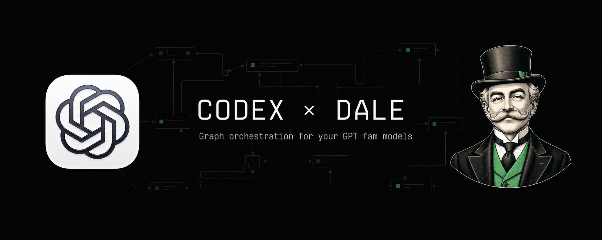
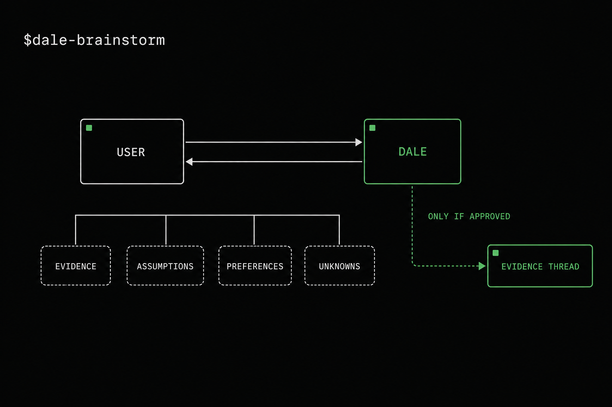
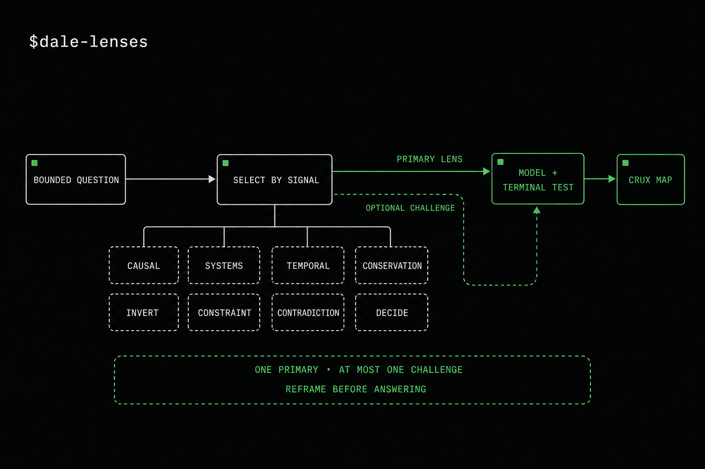
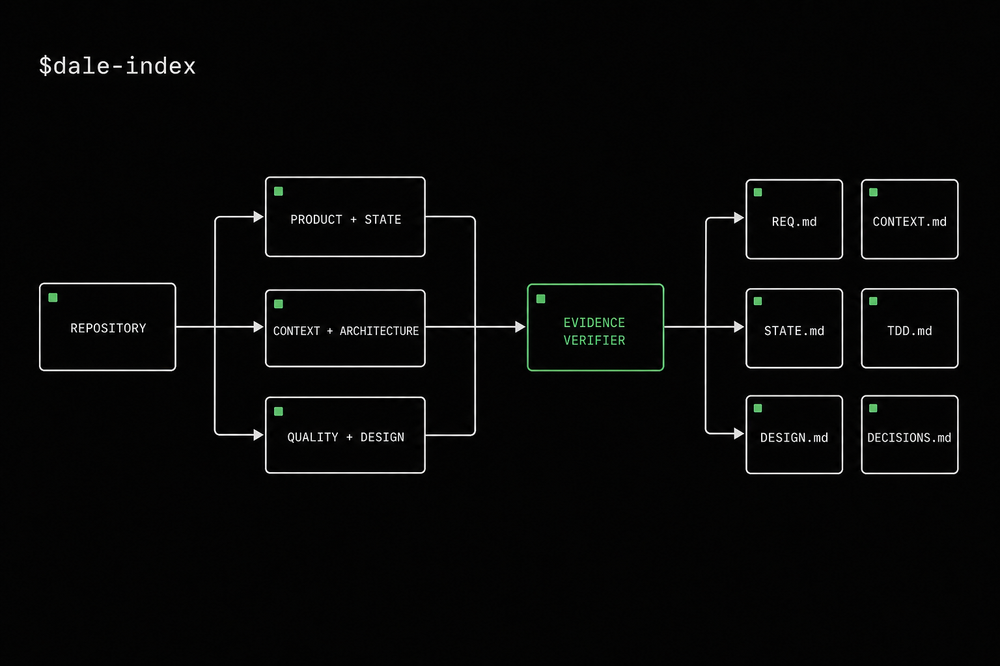
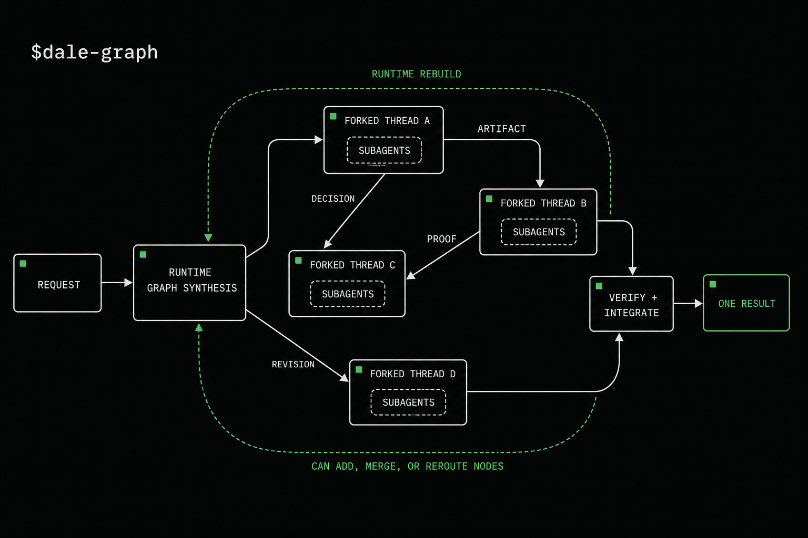
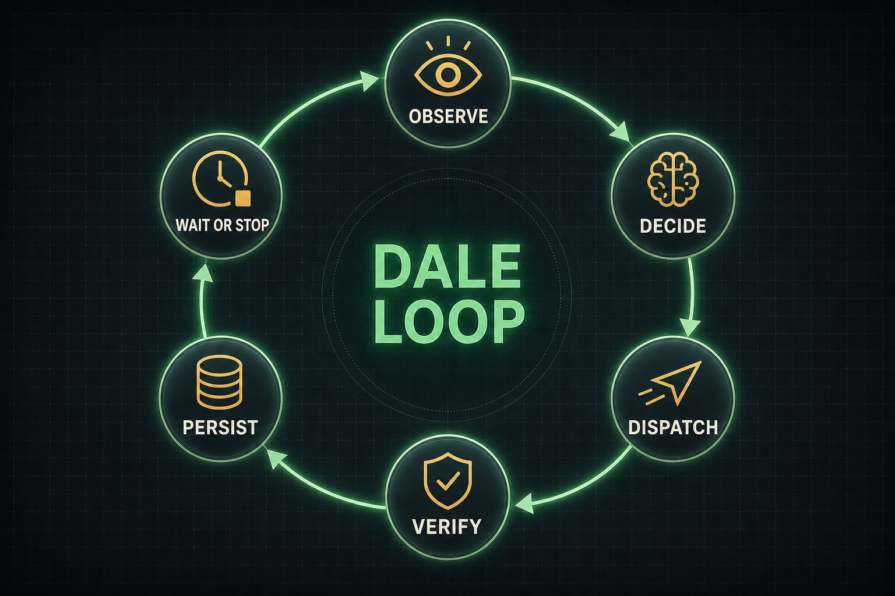
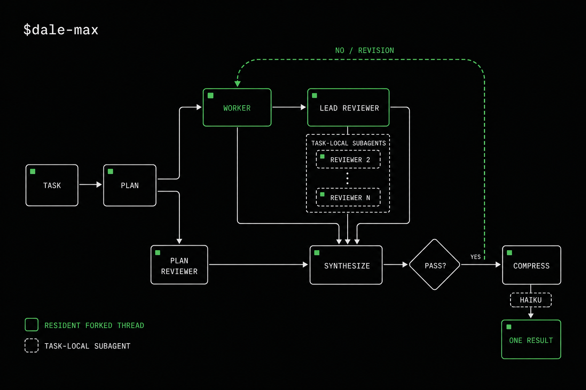
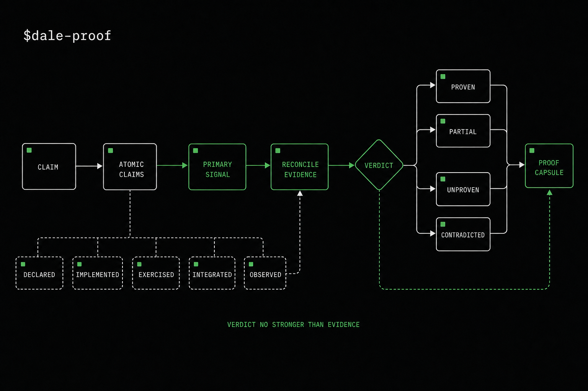
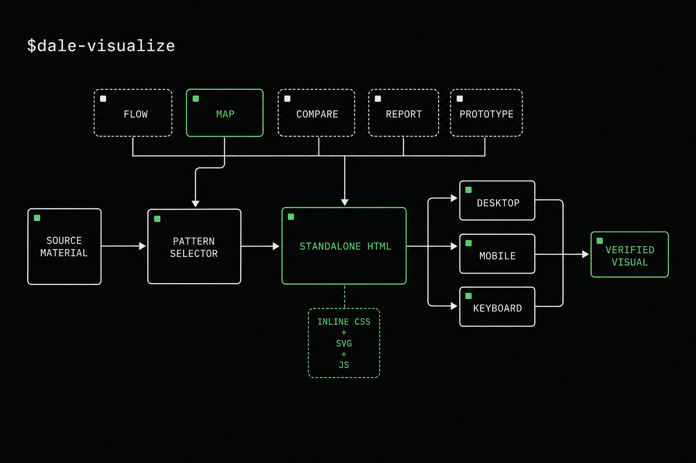

# Dale



A compact development toolbox for Codex: think one-on-one, reframe hard
problems through rigorous lenses, build a trusted repository index, synthesize
a task graph that adapts while it runs, keep repeatable agent work moving in a
verified loop, put consequential work through a resident review loop, prove
technical claims against direct evidence, or turn complex material into an
effective standalone HTML visualization.

## Install

```sh
curl -fsSL https://borkiss.net/dale-install.sh | sh
```

`dale` is an interactive TUI installer built on the grok-build pager stack;
headless flags (`install`, `update`, `list --json`, `uninstall`, with
`--yes`, `--codex-home`, `--update-url`, `--agents-md`) exist for agents and
CI — see [tui/README.md](tui/README.md).

## Skills

### `$dale-brainstorm`



A focused conversation between you and the current Codex agent. It keeps the
work in exploration mode instead of rushing into a plan or implementation.

- stays one-on-one by default;
- separates evidence, assumptions, preferences, and unknowns;
- challenges the strongest option instead of agreeing automatically;
- proposes at most one visible evidence task, only when a separable research
  question emerges and you explicitly approve it;
- routes an approved evidence task to the cheapest sufficient GPT-5.6 model.

### `$dale-lenses`



Applies one primary reasoning lens and, only when it can change the conclusion,
one challenging lens to a bounded difficult problem.

- selects causal, systems, temporal, conservation, inversion, constraint,
  contradiction, or decision-theoretic reasoning by problem signature;
- requires a method-specific artifact instead of a tour of frameworks;
- fixes a falsifier or stop condition before interpreting new evidence;
- exposes the assumptions and observations that can reverse the conclusion;
- stays in the current task and does not silently plan or execute.

Its result is a compact crux map: model, evidence boundary, risky prediction,
decision impact, and remaining unknowns.

### `$dale-index`



Turns the current repository into six evidence-backed project primitives:

| Primitive | Source of truth for |
|---|---|
| `REQ.md` | Product intent, scope, requirements, and acceptance criteria |
| `CONTEXT.md` | Architecture, repository map, contracts, and constraints |
| `STATE.md` | Current objective, active work, blockers, risks, and next actions |
| `TDD.md` | Test strategy, commands, quality gates, and missing coverage |
| `DESIGN.md` | Visual language, primitives, states, and accessibility |
| `DECISIONS.md` | Durable decisions, alternatives, evidence, and consequences |

Dale launches three parallel, read-only discovery tasks, then sends their raw
reports through an adversarial evidence verifier. The calling task is the sole
integrator and writes only claims that survive verification.

Each visible task is routed independently across GPT-5.6 Luna, Terra, and Sol.
Repository inventory does not default to frontier-level reasoning.

### `$dale-graph`



Builds a unique execution graph directly from the request. It does not choose a
fixed diamond, pipeline, debate, or other remembered template.

1. Derives observable outcomes, artifacts, evidence boundaries, and ownership.
2. Creates only the nodes and edges justified by the work.
3. Forks the calling Codex task when available, inheriting its completed
   history and project context.
4. Sends the active request and exact node contract into every fork because an
   unfinished turn is not part of inherited history.
5. Routes every node to the cheapest sufficient GPT-5.6 model and reasoning
   effort.
6. Lets every visible node orchestrate one bounded layer of node-local
   subagents inside its own authority and write scope.
7. Rebuilds the graph when runtime evidence changes dependencies, proof needs,
   or required work.
8. Verifies, rejects, revises, and integrates surviving artifacts into one
   result.

The outer graph remains visible and user-owned. Node-local subagents cannot
create Codex tasks, expand authority, or spawn another agent layer.

### `$dale-loop`



Designs the smallest closed loop that can keep agent work moving without making
the user carry state between steps:

```text
observe -> decide -> dispatch -> verify -> persist -> wait or stop
```

The core skill chooses a focused variant when the work has a clear shape:

| Skill | Loop shape |
|---|---|
| `$dale-loop-project` | Split a multi-PR project, review each head, and carry clean changes through merge |
| `$dale-loop-pr` | Watch and repair one pull request until it is merge-ready or blocked |
| `$dale-loop-repo` | Run a conservative recurring repository-maintenance heartbeat |
| `$dale-loop-watch` | Monitor a changing source and react only to meaningful changes |
| `$dale-loop-goal` | Keep one linear task moving until its completion predicate passes |

Every variant defines objective verification, persistent state, resource
limits, and human gates. Live systems outrank stale task reports, and an agent's
own completion claim is never sufficient proof.

### `$dale-max`

Runs a fixed high-assurance control loop for consequential work. Unlike Dale
Graph, which creates its topology on the fly, Dale Max preserves the topology
below while generating reviewer lenses, proof obligations, and model routes
from the actual task.



1. The coordinator plans the outcome and direct proof.
2. A persistent forked Codex Worker thread produces the artifact, receives every
   revision, and may spawn its own task-local subagents.
3. A persistent forked Codex Reviewer 1 / Lead Reviewer thread creates fresh
   Reviewer 2..N subagents with `spawn_agent` only for material, task-specific
   failure modes.
4. A fresh Plan Reviewer checks the initial plan, then another fresh instance
   checks plan drift against each actual result.
5. The coordinator synthesizes evidence and applies a `PASS`, `REVISE`,
   `REJECT`, or `BLOCKED` gate.
6. Failed criteria loop back to the same Worker; a passed result is compressed
   into the shortest complete handoff.

Green nodes in the diagram are resident forked Codex threads; white nodes are
ephemeral phases or `spawn_agent` subagents. Every green thread receives
explicit authority to spawn one level of task-local subagents and must report
that the capability is available before its artifact can pass. “Turn into
haiku” means concise editorial compression, not
a literal poem unless requested. Dale Max is explicit-only because it runs an
exhaustive review loop with no preset cost, token, reviewer-count, or cycle
budget.

### `$dale-proof`



Verifies an existing implementation, fix, migration, deployment, runtime
behavior, or compatibility claim without turning verification into a
remediation or independent-review loop.

- splits broad success statements into atomic material claims;
- works backward from each claim to the shortest decisive primary signal;
- distinguishes declared, implemented, exercised, integrated, and observed
  behavior;
- reconciles conflicting evidence by directness, target, revision, freshness,
  reproducibility, and coverage rather than majority vote;
- returns scoped `PROVEN`, `PARTIAL`, `UNPROVEN`, or `CONTRADICTED` verdicts.

Missing runtime or user-visible evidence stays missing: source inspection and
green secondary checks cannot manufacture a full pass.

### `$dale-visualize`



Turns code, architecture, research, plans, comparisons, reports, incidents,
design systems, concepts, and editable decisions into a self-contained HTML
artifact.

- selects one primary pattern and at most two supporting patterns from
  Anthropic's MIT-licensed `html-effectiveness` examples;
- adapts the information shape instead of copying fictional sample content;
- defaults to standalone HTML with inline CSS, SVG, and minimal JavaScript;
- uses interaction only when it improves understanding or enables a decision;
- preserves source evidence and labels unknowns instead of inventing data;
- verifies desktop, mobile, keyboard, interactions, and runtime errors in a real
  browser before delivery.

The bundled gallery includes patterns for comparisons, code review, module
maps, design systems, prototypes, SVG figures, flowcharts, explainers, plans,
reports, incidents, slide decks, and small editing interfaces.

## GPT-5.6 routing

| Model | Default role |
|---|---|
| Luna | Bounded discovery, inventory, extraction, and narrow checks |
| Terra | Everyday implementation, debugging, integration, and normal proof |
| Sol | Difficult cross-layer synthesis and consequential ambiguity |

The live Codex tool schema is authoritative. Dale shows the selected model,
reasoning effort, and concrete routing reason before dispatch. Sol at `xhigh`,
`max`, or `ultra` is never inherited merely because the coordinator uses it.

Dale Lenses and Dale Proof stay in the current task by default. They do not
create visible tasks or hidden subagents merely to multiply perspectives or
make a verdict appear independent.

## Principles

- visible Codex tasks for top-level ownership;
- node-local subagents for bounded inner parallelism;
- runtime graph synthesis instead of predefined orchestration shapes;
- explicit read/write scopes and conflict edges;
- evidence before synthesis;
- falsifiable models before confident conclusions;
- verdicts no stronger than their direct evidence;
- verify first, integrate second;
- no Git mutation unless the user requested it.

## Repository layout

```text
.codex-plugin/plugin.json
skills/
  dale-brainstorm/
  dale-lenses/
  dale-index/
  dale-graph/
  dale-loop/
  dale-loop-project/
  dale-loop-pr/
  dale-loop-repo/
  dale-loop-watch/
  dale-loop-goal/
  dale-max/
  dale-proof/
  dale-visualize/
assets/
  dale-banner.png
  dale-icon.png
  dale-logo.png
  dale-brainstorm.png
  dale-lenses.png
  dale-index.png
  dale-graph.png
  dale-loop.png
  dale-proof.png
  dale-visualize.png
```

Select a skill from Codex or invoke it explicitly with `$dale-brainstorm`,
`$dale-lenses`, `$dale-index`, `$dale-graph`, `$dale-loop` (or one of its five
focused variants), `$dale-max`, `$dale-proof`, or `$dale-visualize`.

## License

Dale is licensed solely under the [Mozilla Public License 2.0](LICENSE).
Bundled third-party examples retain the license notices shipped with their
source distributions.
